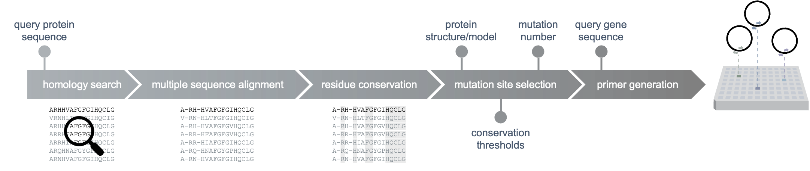
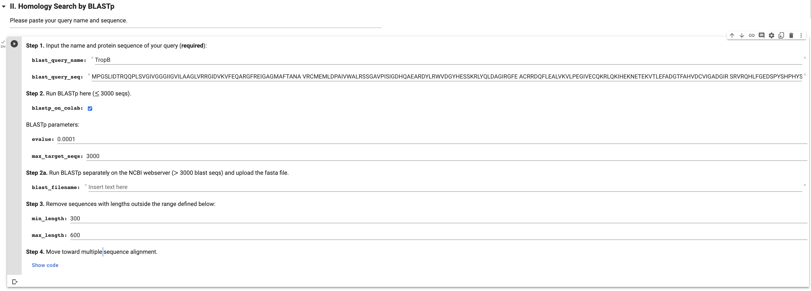
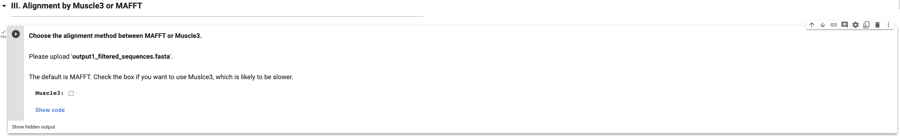

# `SSM_workflow`

## General:

The workflow is used for site-saturation mutagenesis (SSM) library preparation, designed to hugely decrease the time effort potential users put into when preparing SSM libraries.

The workflow enables:

- Determination of *N* mutation sites for the SSM targeting activity enrichment for your protein of interest
- Generation of *N* primer pairs ready for order

Users need to prepare three items in advance:

- Protein structure/model
- Protein sequence
- Gene sequence

There are multiple ways to create SSM libraries. This workflow follows the method in ["Biocatalytic oxidative cross-coupling reactions for biaryl bond formation"](https://www.nature.com/articles/s41586-021-04365-7#Sec3) and was primarily designed for it. Our SSM method works reasonably fine and robustly. If you are using your own in-house method to create SSM libraries, the workflow might not accomodate it. However, you are still welcome to modify the codes to fit you own needs.

[Running `SSM_workflow` in Google Colab](https://colab.research.google.com/drive/1EpV37cbThBZ0HcOOblgUYhhWPXHYe2YD?usp=sharing)

The `SSM_workflow`

The **SSM_workflow streamlines and automates steps for preparing a SSM library**, as detailed below. The concept of the workflow is that for people who want to evolve their protein of interest using SSM can start from the structure or model of that protein and quickly access all primers for the SSM library. At this moment, the workflow can be only used for directed evolution targeting activity but can be extended to target solubility as well if there is a requirement. 

1. Homology search by BLASTp
2. Multiple sequence alignment (MSA)
3. Residue conservation calculation
4. Mutation site selection focused around the user-defined active site
5. Primer generation for all mutation sites in SSM
6. Mutation site visualization in PyMol

If you already know which sites to mutate (or want to include more sites) and come with their residue numbers, we also provide an option to skip the entire workflow and only run a [single cell](https://colab.research.google.com/drive/1EpV37cbThBZ0HcOOblgUYhhWPXHYe2YD#scrollTo=-NNC0eIXvLEY&line=5&uniqifier=1) in Colab.

## Demo:

Here I will use TropB, which is a flavin-dependent monooxygenase, as an example to go through the whole SSM_workflow.

In my design, users need to run cells in sequential order (pressing the play button from top to down). In this demo, I will specify issues that you might face or be aware of during the process. Several steps will require you to upload files and you need to basically upload files acquired from previous steps.

Step I:
- "Install PyMol" may take minutes to complete and may report an error. You can ignore the error.

Step II:

- You can run Blastp directly on Colab if you target no more than 3000 homologous sequences. If you want to include more distantly homologous sequences (≥ 3000), it is recommended to do so directly on the NCBI website and download the unaligned blast file in fasta format.

Step III:

- The default alignment method is MAFFT. Muscle3 is an alternative method suitable for less sequences and will generally take longer to run.

Step IV:

